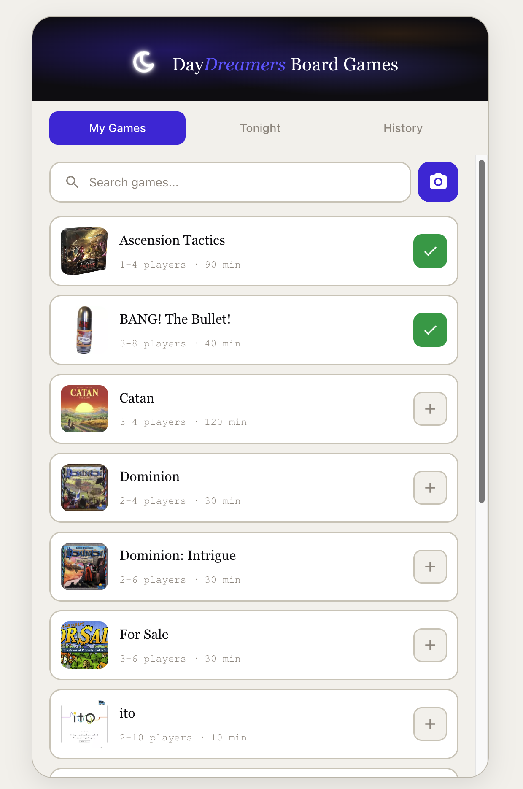

# Daydreamer Board Games

[](https://daydreamer-boardgames.vercel.app)
[](https://vercel.com)
[](LICENSE)

A web app to track your board game collection, log play sessions, and coordinate game nights with friends.


## The Problem

Have you ever hosted a game night and spent 20 minutes debating what to play? Or forgotten which games you even own? Maybe you can't remember who won that epic Catan showdown last month, or you're trying to pick a game that works for 5 players but can't recall which ones fit. And when someone suggests a new game, nobody wants to read through a 20-page rulebook.

**Daydreamer Board Games** solves this by giving your game group a shared space to:
- See everyone's collection at a glance
- Vote on tonight's picks before people arrive
- **Watch tutorial videos** to learn how to play any game in minutes
- Track who played what and who won (bragging rights included)
- Actually remember those legendary game nights

Built for the DayDreamers workshop crew who got tired of the "what should we play?" loop.

## Built With


## Features

- **Game Collection** - Browse your board games with search, images, and details
- **Embedded Tutorials** - Watch YouTube how-to-play videos right in the app—no rulebook required
- **Photo-to-Game** - Snap a photo of a game box to auto-add it (AI-powered)
- **Tonight's Picks** - Pin games and vote on what to play with drag-and-drop ranking
- **Session Management** - Host controls to start/end game nights
- **Play Logging** - Track games played, players, and winners (including co-op support)
- **Shareable Links** - Friends can join and vote without accounts



## Tech Stack

| Component | Technology |
|-----------|------------|
| **Frontend** | Next.js 16 (App Router), React, TypeScript |
| **Styling** | Tailwind CSS, CSS Variables |
| **Database** | Supabase (PostgreSQL) |
| **Scraper** | Go CLI with [browser-use](https://browser-use.com) for BoardGameGeek |
| **Deployment** | Vercel |
| **Drag & Drop** | @dnd-kit |

## Architecture

```
┌──────────────────────────────────────┐
│           Next.js App                │
│  ┌────────────┐  ┌────────────────┐  │
│  │   Pages/   │  │  API Routes    │  │
│  │   React    │  │  (server)      │  │
│  └────────────┘  └───────┬────────┘  │
└──────────────────────────┼───────────┘
                           │
                    ┌──────▼──────┐
                    │  Supabase   │
                    │  (Postgres) │
                    └─────────────┘
                           ▲
                           │ seed
┌──────────────────────────┴───────────┐
│  Go Scraper (browser-use)            │
│  → Scrapes BoardGameGeek             │
│  → Outputs JSON for DB seeding       │
└──────────────────────────────────────┘
```

## Project Structure

```
daydreamer-boardgames/
├── app/                  # Next.js application
│   ├── src/app/          # App router pages
│   ├── src/lib/          # Supabase client
│   └── supabase/         # Migrations & seed data
├── boardgames-scraper/   # Go CLI scraper
│   ├── cmd/              # CLI commands
│   └── data/             # Scraped game data
├── examples/             # Example JSON data files
│   ├── games_input.json  # Sample scraper input
│   └── games_output.json # Sample scraped output
└── CLAUDE.md             # Development log
```

## Getting Started

### Prerequisites

- Node.js 18+
- Go 1.21+ (for scraper)
- Supabase account

### App Setup

```bash
cd app
npm install
cp .env.example .env.local  # Add your Supabase credentials
npm run dev
```

### Scraper Usage

```bash
cd boardgames-scraper
cp .env.example .env  # Add BROWSER_USE_API_KEY

go build -o boardgames-scraper .
./boardgames-scraper scrape -i data/games_input.json
```

## Data Models

| Table | Purpose |
|-------|---------|
| `games` | Board game collection (name, players, time, image, BGG data) |
| `sessions` | Game night sessions with status (voting/playing/completed) |
| `session_votes` | Ranked voting per session |
| `game_results` | Logged plays with co-op support |
| `player_results` | Individual player scores and winners |

## Development Log

See [CLAUDE.md](CLAUDE.md) for detailed session-by-session development notes.

## License

MIT
